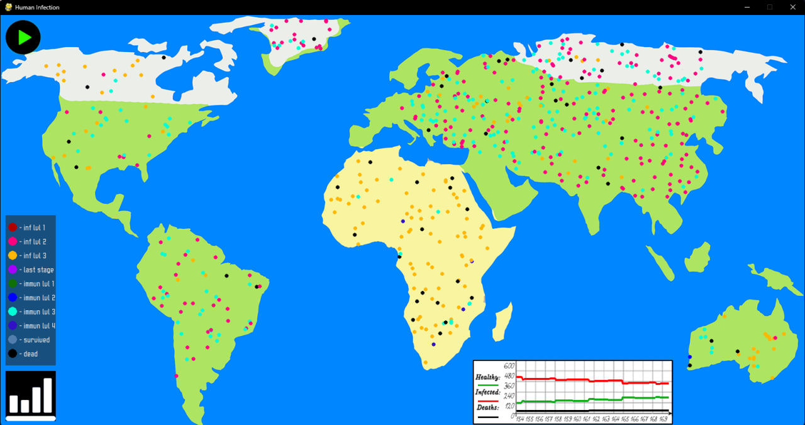
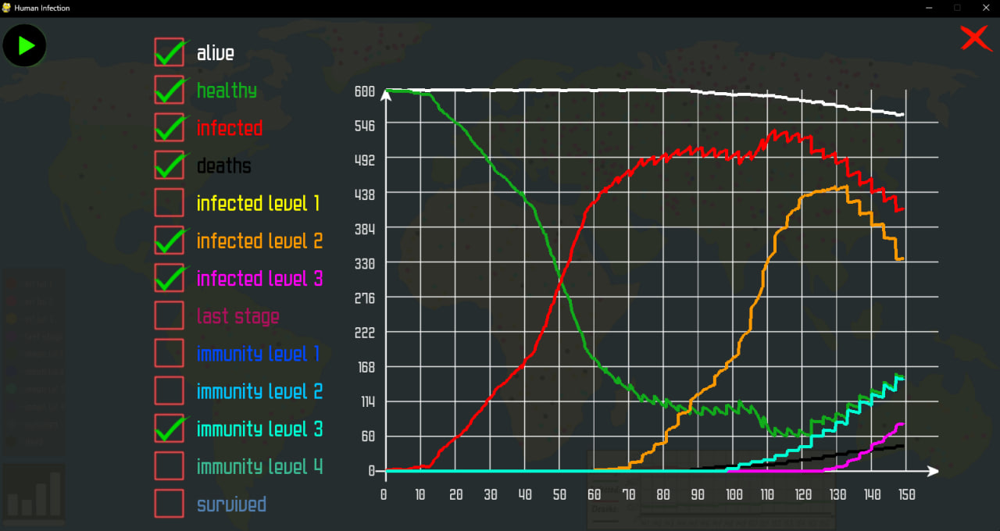
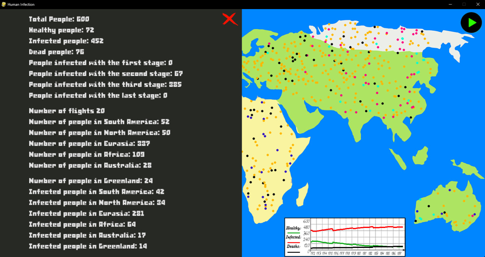

# Earth Infection Simulation
An interactive virus spread simulation developed in Python using Pygame. 

The project simulates the spread of a virus across a two-dimensional map of the Earth. People move around different continents, interact with each other, become infected, recover, develop immunity, and travel between continents. The project was inspired by the core concept of Plague Inc., with the simulation mechanics implemented independently.

## Features
- Population simulation across six regions
- Random movement and interaction between individuals
- Infection transmission based on social activity
- Individual immunity levels
- Four stages of virus development
- Age-dependent recovery probability
- Increasing mortality risk as the virus develops
- Travel between continents with animated flights
- Real-time statistics for healthy, infected, recovered, and deceased people
- Interactive graphs showing infection development over time
- Pause/play controls and detailed statistics view
- Visual representation of infection and immunity stages

## How the Simulation Works

Each person is represented as an individual object with characteristics such as:

- Age
- Immunity level
- Social activity
- Travel activity
- Current continent
- Infection status
- Virus level

The simulation begins with one randomly selected infected person. People move around their continents and infected individuals can transmit the virus when interacting with healthy people. The probability of transmission is influenced by their social activity and the immunity of the healthy person. Infected individuals may recover, develop immunity, progress to a more advanced virus stage, or die. Recovery probability is influenced by age. Infected individuals can also travel between continents, allowing the infection to spread across the world. Because many events are probability-based, each simulation can develop differently.

## Technologies
- Python
- Pygame
- Object-Oriented Programming
- Probability-based simulation
- Real-time data visualization

## Project Structure
`main.py` contains the main simulation, movement, travel, statistics, visualization, and interface logic.
`person.py` contains the `Human` class and `Infected` subclass used to represent individuals and infection behavior.
Additional images, fonts, and audio resources are stored in separate folders.

## Installation

Clone the repository:
```bash
git clone https://github.com/Maxnorm31415/infection.git
cd infection
```

Run the simulation:

```bash
python main.py
```

## Screenshots

### Infection Statistics



### Detailed Statistics


